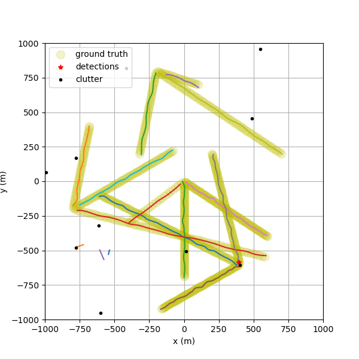
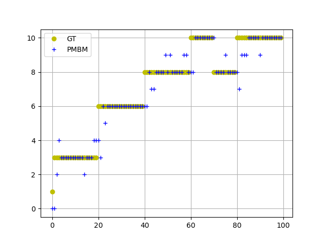
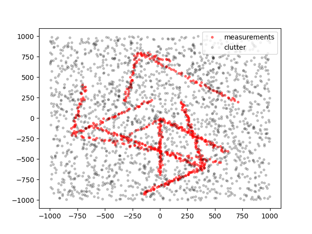

# 安装

## 依赖库

- python基本库，推荐安装anaconda，python版本>=3.7

  下载地址

  https://www.anaconda.com/products/distribution

- 其他依赖库：

  - opencv-python: `pip install opencv-python`

  - cmake：编译murty库需要，可在官网下载对应平台的版本

  - eigin: 编译murty库需要，ubuntu系统下`sudo apt install libeigen3-dev`

  - murty：

    注意该库编译目前仅在linux系统编译测试过

  ```bash
  git clone --recursive https://github.com/erikbohnsack/murty.git
  pip3 install ./murty
  ```
  
  该库编译时存在一些问题，需要修改下编译代码再运行上述安装指令：

  1. `setup.py`中L48，删除`'-DPYTHON_EXECUTABLE=' + '/usr/local/opt/python/bin/python3.7'`
  2. `CMakeList.txt`中L5需正确设置eigen包含路径：`SET( EIGEN3_INCLUDE_DIR "/your/path/to/eigen3" )`

## 例程运行

`python demo_pmbm_tracker.py`正确输出如下结果即安装正常。





